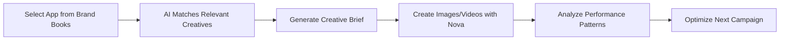

# 🎨 AdCaleidoscope Creative OS

> *Turning creative chaos into performance patterns*

[](https://aws.amazon.com/bedrock/)
[](https://aws.amazon.com/bedrock/nova/)

**🏆 AWS Generative AI Hackathon Project**  
*Created during AWS Workshop Studio - Generative AI Hackathon*

**AdCaleidoscope** is an AI-powered creative management platform that transforms how mobile advertising teams create, analyze, and optimize their campaigns. Like a kaleidoscope that reveals beautiful patterns from fragments, AdCaleidoscope discovers winning creative patterns from your campaign data.

Built specifically to showcase the power of **Amazon Nova models** in a real-world creative workflow, demonstrating how AI can revolutionize mobile advertising creative processes.

## ✨ What Makes AdCaleidoscope Special

🧠 **AI-Powered Intelligence** - Amazon Nova models generate briefs, images, and videos  
📊 **Pattern Recognition** - Discover what makes creatives perform with real analytics  
🎯 **Smart Targeting** - Brand Books integration with keyword-matched recommendations  
🔄 **Hybrid Architecture** - Seamlessly switch between local development and cloud production  
⚡ **Real-Time Analytics** - DuckDB processes performance data instantly  

## 🏗️ Architecture Overview

```
┌─────────────────┐    ┌─────────────────┐    ┌─────────────────┐
│   LOCAL MODE    │    │   CLOUD MODE    │    │   ANALYTICS     │
│                 │    │                 │    │                 │
│ • LocalStack    │◄──►│ • AWS Bedrock   │◄──►│ • DuckDB        │
│ • Mock Services │    │ • Real AI Gen   │    │ • Performance   │
│ • Development   │    │ • Production    │    │ • Insights      │
└─────────────────┘    └─────────────────┘    └─────────────────┘
```

### 🛠️ Tech Stack
- **Frontend**: Next.js 15, React 19, TypeScript, TailwindCSS
- **AI Generation**: Amazon Nova Pro/Canvas/Reel
- **Analytics**: DuckDB, SQL-based insights  
- **Infrastructure**: LocalStack (dev) + AWS (prod)
- **Storage**: Local files + S3 hybrid
- **UI**: shadcn/ui components

## 🔒 Security Setup

⚠️ **IMPORTANT**: Never commit AWS credentials to git!

1. Copy environment template:
```bash
cp .env.example .env.local
```

2. Add your real AWS credentials to `.env.local`:
```bash
# Edit .env.local with your actual credentials
AWS_ACCESS_KEY_ID=your_actual_key_here
AWS_SECRET_ACCESS_KEY=your_actual_secret_here
```

3. Verify `.env*` files are in `.gitignore` (they are):
```bash
# This should show .env* is ignored
git status
```

## 🚀 Quick Start

### Prerequisites
- Node.js 20+
- Docker & Docker Compose
- AWS CLI + awslocal (LocalStack client)

```bash
# Install awslocal
pip install awscli-local

# Or via npm
npm install -g @localstack/awscli-local
```

### Setup

1. **Clone and install dependencies:**
```bash
git clone <repo>
cd adcaleidoscope
npm install
```

2. **Configure environment:**
```bash
cp .env.example .env.local
# Edit .env.local with your AWS Bedrock credentials
```

3. **Start LocalStack:**
```bash
docker-compose up -d localstack
```

4. **Initialize AWS resources:**
```bash
./scripts/init-localstack.sh
```

5. **Start the application:**
```bash
npm run dev
```

Open http://localhost:3000

## 🎯 Core Features

### 📝 **Brand Books & Targeting**
- **Smart App Selection**: Choose from pre-configured brand portfolios
- **Keyword Matching**: AI matches relevant high-performing creatives  
- **Auto-Population**: Brand data flows automatically into brief generation
- **Performance Insights**: See which creatives match your keywords

### 🤖 **AI-Powered Brief Generation**  
- **Nova Pro Integration**: Generate comprehensive creative briefs
- **Template System**: Customizable prompt templates for different formats
- **Context-Aware**: Includes relevant creative examples in prompts
- **One-Click Generation**: Auto-fills based on brand and audience data

### 🎨 **Creative Generation**
- **Nova Canvas**: Generate high-converting banner images
- **Nova Reel**: Create engaging video creatives (6-30s)  
- **Multi-Format Support**: Images, videos, and interactive content
- **Quality Controls**: Built-in validation and optimization

### 📊 **Pattern Analysis**
- **Performance Analytics**: Real CTR, CPI, IPM data from campaigns
- **Success Prediction**: ML-powered probability scoring
- **Keyword Insights**: Discover which themes drive performance
- **Scene Analysis**: Break down video creative components

### 🏪 **Creative Library**
- **Asset Management**: Organize all creative assets
- **Version Control**: Track creative iterations and performance
- **Bulk Operations**: Manage multiple creatives efficiently
- **Smart Search**: Find creatives by performance, keywords, or metrics

## 🔧 Environment Variables

### Required (Bedrock)
```env
AWS_REGION=us-east-1
AWS_ACCESS_KEY_ID=your_key
AWS_SECRET_ACCESS_KEY=your_secret
```

### Optional (LocalStack)
```env
USE_LOCAL_AWS=true
LOCALSTACK_URL=http://localhost:4566
STORAGE_TYPE=local
```

### Bedrock Models
```env
BEDROCK_MODEL_TEXT=amazon.nova-pro-v1:0
BEDROCK_MODEL_IMAGE=amazon.nova-canvas-v1:0  
BEDROCK_MODEL_VIDEO=amazon.nova-reel-v1:0
```

## 📁 Project Structure

```
src/
├── app/
│   ├── dashboard/           # KPIs and overview
│   ├── library/            # Creative management
│   ├── briefs/            # Brief builder with Monaco Editor
│   ├── playground/        # MRAID sandbox
│   ├── patterns/          # Pattern analysis
│   ├── experiments/       # A/B testing
│   ├── settings/          # Provider configurations
│   └── api/
│       ├── brief/         # Nova Pro integration
│       ├── generate/      # Nova Canvas/Reel
│       ├── analytics/     # DuckDB queries
│       └── upload-url/    # S3 presigned URLs
├── lib/
│   ├── aws.ts            # AWS SDK clients with LOCAL/CLOUD switching
│   ├── analytics/        # DuckDB integration
│   ├── providers/        # AI generation providers
│   └── utils/           # S3 upload, schemas, templates
└── components/          # Reusable UI components
```

## 🛠️ Development

### LocalStack Management
```bash
# Start LocalStack
docker-compose up -d

# Check status
curl http://localhost:4566/health

# Re-initialize resources
./scripts/init-localstack.sh

# Stop LocalStack
docker-compose down
```

### Analytics
```bash
# Generate mock data
curl -X POST http://localhost:3000/api/analytics \
  -H "Content-Type: application/json" \
  -d '{"type": "generate-mock-data"}'

# Get dashboard KPIs
curl http://localhost:3000/api/analytics?type=overview
```

### Switch to Cloud Mode
```bash
# Update .env.local
USE_LOCAL_AWS=false
STORAGE_TYPE=s3

# Restart application
npm run dev
```

## 📱 User Journey



### 🔄 **Typical Workflow**
1. **Choose Brand** → Select app from Brand Books
2. **Smart Matching** → System shows relevant high-performing creatives
3. **Generate Brief** → AI creates detailed creative brief with context
4. **Create Assets** → Generate images/videos with Nova models
5. **Analyze Results** → Study performance patterns and insights
6. **Iterate & Improve** → Apply learnings to next campaign

## 💡 **Why AdCaleidoscope?**

**Traditional Creative Process:**
- Manual brief writing takes hours
- No connection between past performance and new creative
- Scattered data across multiple platforms
- Guesswork on what creative elements work

**With AdCaleidoscope:**
- ⚡ Brief generation in seconds
- 🎯 AI-powered creative recommendations  
- 📊 Unified performance analytics
- 🔍 Data-driven creative insights

## 🔍 Validation Checklist

✅ Nova Pro generates creative briefs  
✅ Nova Canvas/Reel creates images/videos  
✅ Step Functions orchestrates generation workflow  
✅ SQS receives job messages  
✅ EventBridge publishes completion events  
✅ DynamoDB stores creative metadata  
✅ Local file storage with S3 fallback  
✅ MRAID sandbox plays playables  
✅ DuckDB analytics with mock data  
✅ Performance KPIs and insights  

## 📊 Monitoring

- LocalStack Dashboard: http://localhost:4566  
- AWS Resources: Use `awslocal` commands
- DuckDB: Query analytics database directly
- Application: Built-in performance monitoring

## 🚀 **Getting Started - 5 Minutes**

Want to see AdCaleidoscope in action? Follow this quick demo:

1. **Start the app**: `npm run dev`
2. **Visit Brand Books**: Navigate to `/brandbooks`
3. **Create a Brief**: Go to `/briefs/new` and select "Business Empire" 
4. **See Smart Matching**: Watch AI match relevant creatives by keywords
5. **Generate**: Click "Generate from Brief" to see Nova Pro in action
6. **Explore Patterns**: Check `/patterns` for performance analytics

## 🎨 **Screenshots**

*Coming soon - UI screenshots showcasing the key features*

## 🤝 **Contributing**

We welcome contributions! Please:

1. 🔧 Follow existing TypeScript patterns
2. 🧪 Test both LOCAL and CLOUD modes  
3. 📚 Update documentation for new features
4. 🎯 Ensure real data compatibility

## 📞 **Support & Feedback**

- 🐛 **Issues**: Report bugs via GitHub Issues
- 💡 **Feature Requests**: Share ideas for improvements  
- 📧 **Contact**: Reach out for enterprise deployments

## 🏆 **AWS Generative AI Hackathon**

This project was developed for the **AWS Workshop Studio - Generative AI Hackathon**, showcasing innovative applications of Amazon's newest AI models:

### 🎯 **Hackathon Goals Achieved**
- ✅ **Nova Pro**: Advanced text generation for creative briefs
- ✅ **Nova Canvas**: High-quality image generation for advertising
- ✅ **Nova Reel**: Video creative generation (cutting-edge!)
- ✅ **Real-World Application**: Actual mobile advertising use case
- ✅ **End-to-End Workflow**: Complete creative-to-analytics pipeline
- ✅ **Hybrid Architecture**: Local development + cloud production

### 🚀 **Innovation Highlights**
- **Smart Keyword Matching**: AI connects brand data with performance patterns
- **Context-Aware Generation**: Creative recommendations inform new content
- **Pattern Discovery**: ML insights from real campaign data
- **Hybrid Development**: Seamless local-to-cloud deployment

### 🏅 **Technical Achievement**
AdCaleidoscope demonstrates how **Generative AI can transform traditional workflows** by:
1. Automating manual creative brief writing
2. Connecting historical performance data with new creative generation  
3. Providing actionable insights for creative optimization
4. Enabling rapid iteration and testing of creative concepts

*Built with ❤️ for the AWS Generative AI community*

---

*AdCaleidoscope - Where Creative Chaos Becomes Performance Patterns* 🎨
