# 🎨 AdCaleidoscope Creative OS

> *Turning creative chaos into performance patterns*

[](https://aws.amazon.com/bedrock/)
[](https://aws.amazon.com/bedrock/nova/)

**🏆 AWS Generative AI Hackathon Project**  
*Created during AWS Workshop Studio - Generative AI Hackathon*

**AdCaleidoscope** is an AI-powered creative management platform that transforms how mobile advertising teams create, analyze, and optimize their campaigns. Like a kaleidoscope that reveals beautiful patterns from fragments, AdCaleidoscope discovers winning creative patterns from your campaign data.

Built specifically to showcase the power of **Amazon Nova models** in a real-world creative workflow, demonstrating how AI can revolutionize mobile advertising creative processes.

## ✨ What Makes AdCaleidoscope Special

🧠 **AI-Powered Intelligence** - Amazon Nova models generate briefs, images, and videos  
📊 **Pattern Recognition** - Discover what makes creatives perform with analytics insights  
🎯 **Smart Targeting** - Brand Books integration with keyword-matched recommendations  
🔄 **Hybrid Architecture** - Seamlessly switch between local development and cloud production  
⚡ **Real-Time Analytics** - In-memory analytics with comprehensive mock data for demos  
🎮 **MRAID Playground** - Fully functional playable ads sandbox with 2 interactive games  

## 🏗️ Architecture Overview

```
┌─────────────────┐    ┌─────────────────┐    ┌─────────────────┐
│   LOCAL MODE    │    │   CLOUD MODE    │    │   ANALYTICS     │
│                 │    │                 │    │                 │
│ • LocalStack    │◄──►│ • AWS Bedrock   │◄──►│ • In-Memory     │
│ • Mock Services │    │ • Real AI Gen   │    │ • Performance   │
│ • Development   │    │ • Production    │    │ • Insights      │
└─────────────────┘    └─────────────────┘    └─────────────────┘
```

### 🛠️ Tech Stack
- **Frontend**: Next.js 15, React 19, TypeScript, TailwindCSS
- **AI Generation**: Amazon Nova Pro/Canvas/Reel models
- **Analytics**: In-memory analytics with comprehensive mock data  
- **Infrastructure**: AWS Bedrock (real AI) + optional LocalStack (dev)
- **Storage**: Hybrid local files + S3 with smart switching
- **UI**: shadcn/ui components + Monaco Editor
- **Playables**: MRAID 3.0 sandbox with interactive games

## 🔒 Security Setup

⚠️ **IMPORTANT**: Never commit AWS credentials to git!

1. Copy environment template:
```bash
cp .env.example .env.local
```

2. Add your real AWS credentials to `.env.local`:
```bash
# Edit .env.local with your actual credentials
AWS_ACCESS_KEY_ID=your_actual_key_here
AWS_SECRET_ACCESS_KEY=your_actual_secret_here
```

3. Verify `.env*` files are in `.gitignore` (they are):
```bash
# This should show .env* is ignored
git status
```

## 🚀 Quick Start

### Prerequisites
- Node.js 20+
- AWS credentials (for Bedrock API)

### Optional (for local development)
- Docker & Docker Compose (for LocalStack)
- AWS CLI + awslocal (LocalStack client)

```bash
# Optional: Install awslocal for LocalStack development
pip install awscli-local
# Or via npm
npm install -g @localstack/awscli-local
```

### Setup

1. **Clone and install dependencies:**
```bash
git clone <repo>
cd adcaleidoscope
npm install
```

2. **Configure environment:**
```bash
cp .env.example .env.local
# Edit .env.local with your AWS Bedrock credentials
```

3. **Start the application:**
```bash
npm run dev
```

Open http://localhost:3000

### Optional: LocalStack Setup (for full local development)

4. **Start LocalStack:**
```bash
docker-compose up -d localstack
```

5. **Initialize LocalStack resources:**
```bash
./scripts/init-localstack.sh
```

6. **Configure local mode in .env.local:**
```bash
USE_LOCAL_AWS=true
LOCALSTACK_URL=http://localhost:4566
```

## 🎯 Core Features

### 📝 **Brand Books & Targeting**
- **8 Complete Brand Profiles**: Instagram, Spotify, Airbnb, Uber, WhatsApp, Netflix, and more
- **Real App Store Data**: Live links and screenshots from actual app stores
- **Keyword Matching**: Smart search across brand attributes and demographics  
- **Auto-Population**: Brand data flows automatically into brief generation
- **Full-Text Search**: Find brands by any attribute, keyword, or demographic

### 🤖 **AI-Powered Brief Generation**  
- **Nova Pro Integration**: Generate comprehensive creative briefs
- **Template System**: Customizable prompt templates for different formats
- **Context-Aware**: Includes relevant creative examples in prompts
- **One-Click Generation**: Auto-fills based on brand and audience data

### 🎨 **Creative Generation**
- **Nova Canvas**: Generate high-converting banner images
- **Nova Reel**: Create engaging video creatives (6-30s)  
- **Multi-Format Support**: Images, videos, and interactive content (planned)
- **Quality Controls**: Built-in validation and optimization

### 📊 **Pattern Analysis**
- **Performance Analytics**: Comprehensive mock data with realistic KPIs (CTR, CPI, IPM, ROAS)
- **Success Prediction**: Analytics-based performance scoring
- **Keyword Insights**: Discover which themes drive performance
- **Audience Insights**: Demographics and behavioral analysis

### 🏪 **Creative Library**
- **Asset Management**: Organize all creative assets with local/S3 storage
- **Version Control**: Track creative iterations and performance
- **Bulk Operations**: Manage multiple creatives efficiently
- **Smart Search**: Find creatives by performance, keywords, or metrics

### 🎮 **MRAID Playground**
- **2 Interactive Games**: Memory Match and Endless Runner playables
- **MRAID 3.0 Simulation**: Complete mobile ad SDK simulation
- **Device Testing**: Mobile/tablet viewport switching
- **Event Tracking**: Real-time interaction monitoring
- **Validation System**: Comprehensive playable ad testing


## 📁 Project Structure

```
src/
├── app/
│   ├── dashboard/           # KPIs and overview
│   ├── library/            # Creative management
│   ├── briefs/            # Brief builder with Monaco Editor
│   ├── playground/        # MRAID sandbox
│   ├── patterns/          # Pattern analysis
│   ├── experiments/       # A/B testing
│   ├── settings/          # Provider configurations
│   └── api/
│       ├── brief/         # Nova Pro integration
│       ├── generate/      # Nova Canvas/Reel
│       ├── analytics/     # Analytics endpoints
│       └── upload-url/    # S3 presigned URLs
├── lib/
│   ├── aws.ts            # AWS SDK clients with LOCAL/CLOUD switching
│   ├── analytics/        # Analytics integration
│   ├── providers/        # AI generation providers
│   └── utils/           # S3 upload, schemas, templates
└── components/          # Reusable UI components
```

## 🛠️ Development

### Testing
```bash
# Test MRAID playground
curl http://localhost:3000/playground

# Get dashboard KPIs
curl http://localhost:3000/api/analytics?type=overview
```

## 🎯 User Journey

```mermaid
graph TD
    A[🏢 Choose Brand<br/>Select from 8 detailed<br/>brand profiles] --> B[🎯 Smart Matching<br/>AI finds relevant creatives<br/>by keywords & demographics]
    
    B --> C[📝 Generate Brief<br/>Nova Pro creates<br/>comprehensive brief]
    
    C --> D{🎨 Create Content}
    D --> E[🖼️ Nova Canvas<br/>High-quality images]
    D --> F[🎬 Nova Reel<br/>Engaging videos]
    D --> G[🎮 MRAID Games<br/>Interactive playables]
    
    E --> H[📊 Performance Analysis<br/>Analytics dashboard with<br/>mock campaign data]
    F --> H
    G --> H
    
    H --> I[🔄 Optimize & Iterate<br/>Apply insights to<br/>next campaign]
    I --> A
    
    style A fill:#e1f5fe
    style C fill:#f3e5f5
    style H fill:#e8f5e8
    style I fill:#fff3e0
```



### ✨ **The AdCaleidoscope Experience**

| Step | What You Do | What AdCaleidoscope Does |
|------|-------------|--------------------------|
| **1️⃣ Brand Selection** | Browse brand portfolio | Shows 8 detailed profiles with real app store data |
| **2️⃣ Smart Discovery** | Enter keywords or browse | AI matches relevant creatives by demographics |
| **3️⃣ Brief Creation** | Click "Generate Brief" | Nova Pro creates contextual creative brief |
| **4️⃣ Content Generation** | Choose format & generate | Nova Canvas/Reel creates images/videos |
| **5️⃣ Interactive Testing** | Test in MRAID playground | Experience playable ads on mobile simulation |
| **6️⃣ Performance Insights** | View analytics dashboard | See comprehensive KPIs and audience insights |

## 💡 **Why AdCaleidoscope?**

**Traditional Creative Process:**
- Manual brief writing takes hours
- No connection between past performance and new creative
- Scattered data across multiple platforms
- Guesswork on what creative elements work

**With AdCaleidoscope:**
- ⚡ Brief generation in seconds with Nova Pro
- 🎯 AI-powered creative recommendations from brand data
- 📊 Unified analytics dashboard with comprehensive mock data
- 🔍 Data-driven creative insights and pattern analysis
- 🎮 Interactive playable ad testing with MRAID sandbox


## 🚀 **Getting Started - 5 Minutes**

Want to see AdCaleidoscope in action? Follow this quick demo:

1. **Start the app**: `npm run dev`
2. **Explore Brand Books**: Navigate to `/brandbooks` and browse 8 detailed brand profiles
3. **Create a Brief**: Go to `/briefs/new` and select "Business Empire" or any brand
4. **See Smart Matching**: Watch AI match relevant creatives by keywords
5. **Generate**: Click "Generate from Brief" to see Nova Pro in action
6. **Test Playables**: Visit `/playground` to try interactive MRAID games
7. **Analyze Performance**: Check `/patterns` for comprehensive analytics dashboard

## 🎨 **Screenshots**

*Coming soon - UI screenshots showcasing the key features*

## 🤝 **Contributing**

We welcome contributions! Please:

1. 🔧 Follow existing TypeScript patterns
2. 🧪 Test both LOCAL and CLOUD modes  
3. 📚 Update documentation for new features
4. 🎯 Ensure real data compatibility

## ⚠️ **Implementation Notes**

**This is a demo/hackathon project showcasing Amazon Nova models. Key implementation details:**

- **Analytics**: Uses comprehensive mock data for demonstration purposes
- **AI Generation**: Mix of real Bedrock API integration and mock responses
- **LocalStack**: Full local development environment with AWS service mocking
- **Brand Data**: Real app store links and data for authentic demo experience
- **MRAID Playground**: Fully functional playable ads for interactive testing

## 📞 **Support & Feedback**

- 🐛 **Issues**: Report bugs via GitHub Issues
- 💡 **Feature Requests**: Share ideas for improvements  
- 📧 **Contact**: Reach out for enterprise deployments


---

*AdCaleidoscope - Where Creative Chaos Becomes Performance Patterns* 🎨
