# 🎨 AdCaleidoscope Creative OS

> *Turning creative chaos into performance patterns*

[](https://aws.amazon.com/bedrock/)
[](https://aws.amazon.com/bedrock/nova/)

**🏆 AWS Generative AI Hackathon Project**  
*Created during AWS Workshop Studio - Generative AI Hackathon*

**AdCaleidoscope** is an AI-powered creative management platform that transforms how mobile advertising teams create, analyze, and optimize their campaigns. Like a kaleidoscope that reveals beautiful patterns from fragments, AdCaleidoscope discovers winning creative patterns from your campaign data.

Built specifically to showcase the power of **Amazon Nova models** in a real-world creative workflow, demonstrating how AI can revolutionize mobile advertising creative processes.


### 🛠️ Tech Stack
- **Frontend**: Next.js 15, React 19, TypeScript, TailwindCSS
- **AI Generation**: Amazon Nova Pro/Canvas/Reel models
- **Analytics**: In-memory analytics with comprehensive mock data  
- **Infrastructure**: AWS Bedrock (real AI) + optional LocalStack (dev)
- **Storage**: Hybrid local files + S3 with smart switching
- **UI**: shadcn/ui components


## 🚀 Quick Start

### Prerequisites
- Node.js 20+
- AWS credentials (for Bedrock API)

### Setup

1. **Clone and install dependencies:**
```bash
git clone <repo>
cd adcaleidoscope
npm install
```

2. **Configure environment:**
```bash
cp .env.example .env.local
# Edit .env.local with your AWS Bedrock credentials
```

3. **Start the application:**
```bash
npm run dev
```

Open http://localhost:3000


## 🎯 User Journey

```mermaid
graph TB
    subgraph " "
        A["🏢<br/><b>Brand Selection</b><br/>Choose from 8 brands"]
        B["📝<br/><b>Brief Creation</b><br/>Generate custom prompts"]
        C["🎨<br/><b>Content Creation</b><br/>Nova Canvas & Reel"]
        D["📊<br/><b>Performance Analytics</b><br/>Insights & optimization"]
    end
    
    A --> B
    B --> C
    C --> D
    D -.-> A
    
    style A fill:#e8f4fd,stroke:#1976d2,stroke-width:3px
    style B fill:#f3e5f5,stroke:#7b1fa2,stroke-width:3px
    style C fill:#fff8e1,stroke:#f57c00,stroke-width:3px
    style D fill:#e8f5e8,stroke:#388e3c,stroke-width:3px
```




## 🚀 **Getting Started - 5 Minutes**

Want to see AdCaleidoscope in action? Follow this quick demo:

1. **Start the app**: `npm run dev`
2. **Explore Brand Books**: Navigate to `/brandbooks` and browse 8 detailed brand profiles
3. **Create a Brief**: Go to `/briefs/new` and select "Business Empire" or any brand
4. **See Smart Matching**: Watch keyword-based matching find relevant creatives
5. **Generate Prompt**: Create custom AI prompt for content generation
6. **Generate Content**: Click "Generate" to create images/videos with Nova Canvas/Reel
7. **Analyze Performance**: Check `/patterns` for comprehensive analytics dashboard


---

*AdCaleidoscope - Where Creative Chaos Becomes Performance Patterns* 🎨
